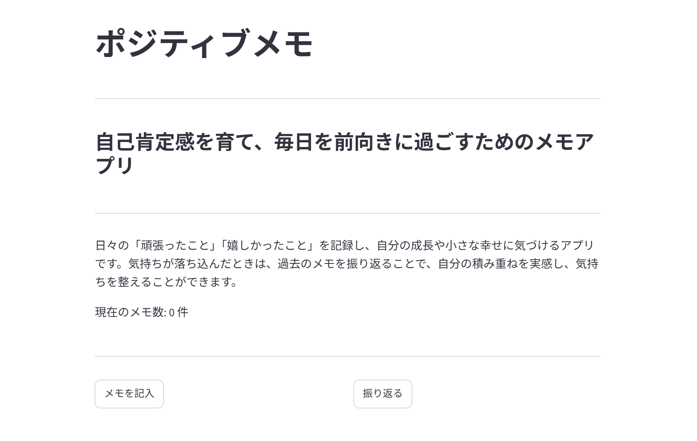
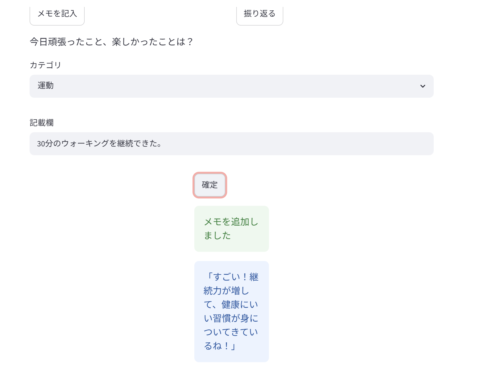
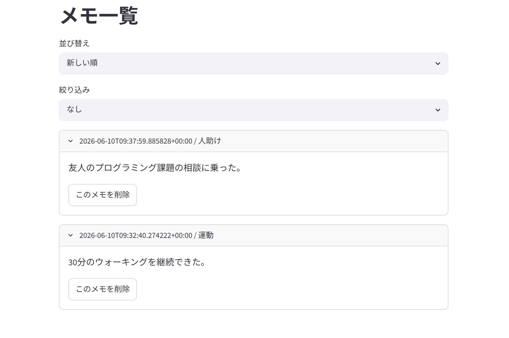

# ポジティブメモ (positive-memo)

自己肯定感を育て、毎日を前向きに過ごすためのメモアプリです。

## アプリURL
https://tera-work-positive-memo-app1-wzlji8.streamlit.app/

## アプリ画面

### トップ画面
「メモを記入」と「振り返る」の2つの主要機能を分かりやすく配置しました。

### 記入画面
カテゴリを選択し、その日の頑張りや嬉しかった出来事を記録できます。入力後はAIからポジティブなフィードバックを受け取れます。

### 振り返り画面
過去のメモを一覧表示し、カテゴリによる絞り込みや不要なメモの削除ができます。

## プロジェクト概要
日々の「頑張ったこと」「嬉しかったこと」を記録し、自分の成長や小さな幸せに気づけるメモアプリです。
気持ちが落ち込んだときは、過去のメモを振り返ることで、自分の積み重ねを実感し、気持ちを整えることができます。

入力した内容に対して、Groq APIを利用したAIがポジティブなフィードバックを返し、自己肯定感を高める体験を提供します。

## 主な機能
- メモの追加
- メモの一覧表示
- カテゴリによる絞り込み
- メモの削除
- AIによるポジティブなフィードバック生成
- Supabaseを用いたメモデータの永続化

## 使用技術
- Frontend / Backend: Streamlit
- Language: Python
- Database: Supabase (PostgreSQL)
- AI / LLM: Groq API (Llama 3.3 70B Versatile)
- Data Processing: Pandas

## 工夫した点
1. レスポンス速度:
   Groq APIを採用することで、AIによるポジティブなフィードバックを短時間で生成します。ユーザーの記録体験を損なわないリアルタイム性を重視しました。
2. 使いやすさを重視したインターフェース:
   Streamlitのシンプルな操作性を活かし、直感的に「記入」と「振り返り」ができるよう設計しました。
3. セキュリティへの配慮:
   APIキーなどの機密情報は環境変数として管理し、ソースコードに直接記述しない仕組みを徹底しています。

1. リアルタイムなAIフィードバック
   Groq APIを採用することで、ユーザーの入力内容に対して短時間で励ましのメッセージを生成できるようにしました。

2. シンプルで直感的なUI
   「メモを記入」と「振り返る」の2つの主要機能を分かりやすく配置し、誰でも迷わず利用できる設計を意識しました。

3. データの永続化
   当初はSession Stateを利用していましたが、Supabaseを導入することで、アプリを再起動してもメモを保持できるよう改善しました。

4. セキュリティへの配慮
   Groq APIキーやSupabaseの接続情報は環境変数として管理し、ソースコード上に直接記載しないようにしました。

## 今後の展望
将来的には以下の機能の実装を検討しています。
- ユーザー認証機能
- ゲスト利用機能
- カテゴリ別の統計・可視化機能
- モバイル端末での利用体験の改善